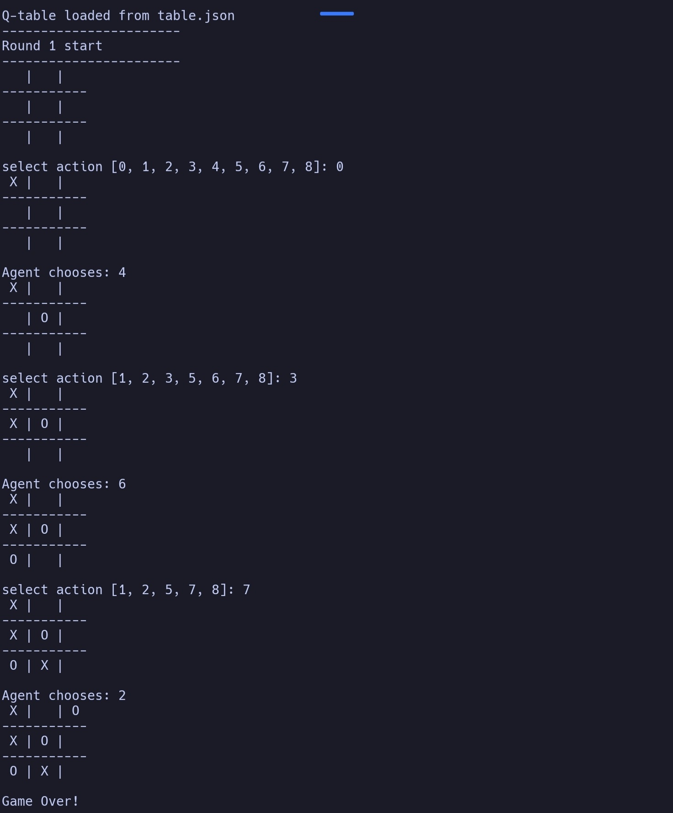
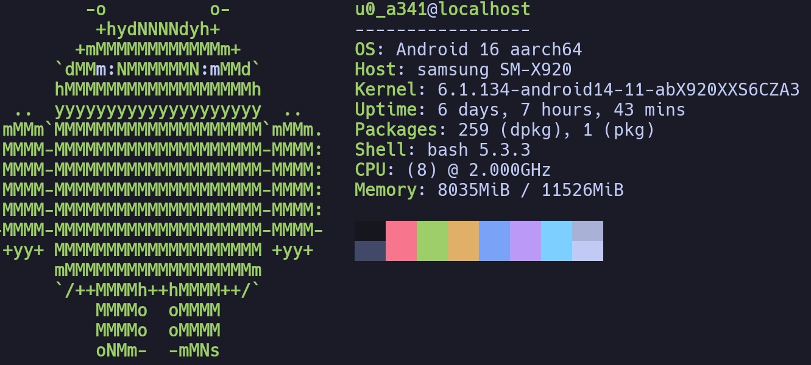
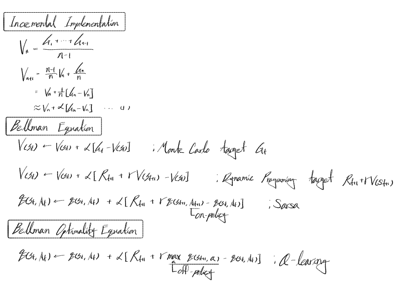
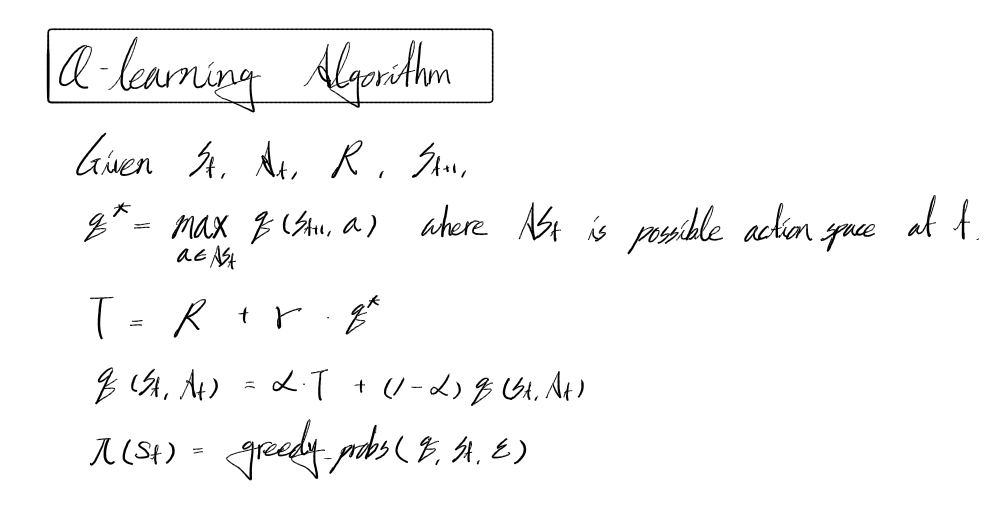
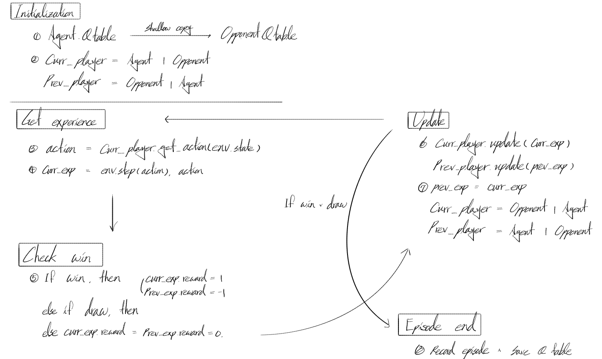
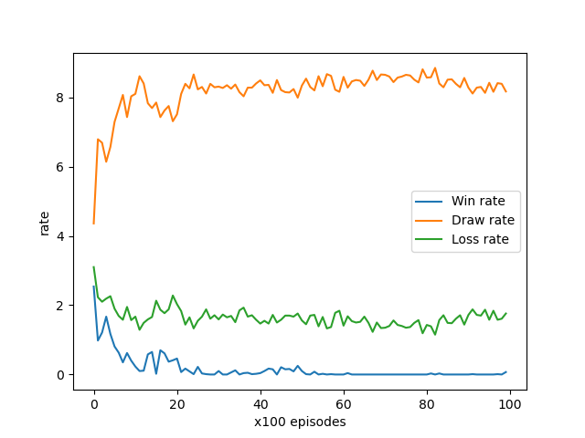

# Overview


에이전트가 동작하는 TicTacToe 환경을 구현하고, 그 환경에서 최적의 행동을 스스로 찾도록 학습시키는 프로젝트입니다. 별도의 데이터셋 없이 Self-Play방식을 통해 Zero-knowledge 상태에서 최적 전략으로 수렴하는 과정을 실험합니다.



Player vs Trained agent

### Previous Future Work

이 프로젝트는 rl-basic 프로젝트의 후속 연구이며 다음의 두 가지 목표를 다룹니다.

- Applying the self-play method.
- Moving beyond basic grid worlds to a game-theoretic environment.

# Environment


### Development Environment



Android 14 aarch64 without external GPU

### Project Information

| Task Type | Reinforcement |
| --- | --- |
| Data | None |
| Loss | TD Error |
| Optimizer | None |

### Entire Directory Structure

```python
tictactoe
├── README.md
├── main.py
├── play.py
├── q_learning.py
├── table.json
├── tictactoe_world.py
└── utils.py
```

# TicTacToe World


### Mathematical Definitions

- Action Space: A discrete space of 9 possible moves (height x width)
- State Space: Less than 19,683((Null or Black or White) ^ 9), since there are cases that can not exist such that
    1. Difference between the number of black and white stones is more than 1.
    2. The game was already ended.
- Reward Function:
    - Win: +1
    - Loss: -1
    - Draw / Ongoing: 0
- End Points: 8(Row win + Column win + diagonal win)

### Implementation Logic

- Initialization: Define action space, state space, and end points. Run reset method.
- Reset: Initialize the board. Random choose start player.
- Step: Update state from action.
- Check win: Check the game is ended.
- Visualization: Render the board.

# Training Methodology

### Q-Learning Algorithm

The state space of Tic-Tac-Toe is computationally tractable enough to save all state value in Q-table.

Q-learning is an off-policy Temporal Difference control algorithm that approximates the Bellman Optimality Equation. By utilizing the maximum Q-value of the subsequent state, it converges to the optimal policy independently of the agent's current exploration strategy.



Induced Bellman Optimality Equation



Q-Learing Algorithm from Bellman Optimality Equation

### Self-Play & Exploration

During training, the agent and the opponent share the same Q-Table to accelerate convergence:

- Learner: Acts greedily based on the current Q-values.
- Opponent: Employs an epsilon-greedy strategy to ensure sufficient exploration of the state space.



Reinforcement Learning Training Loop based on the MDP Framework

As the agent's Q-values converge toward the optimal Q*, the opponent's win rate—even when utilizing an epsilon-greedy strategy—effectively drops to zero.

The empirical results demonstrate that the opponent's win rate converges to zero, validating that the learner has successfully acquired the optimal policy. This confirms that the agent has reached a state where it is theoretically unbeatable, having mastered the minimax-optimal strategy within the Tic-Tac-Toe environment.



Graph of the opponent’s win-draw-loss rate after 10000 episodes

# Future Work

- From a mathematical perspective, many states in Tic-Tac-Toe are isomorphic under the Dihedral Group D_4 action (rotations and reflections). By defining Equivalence Classes for symmetric board states, we can reduce the state space by a factor of approximately 8.
